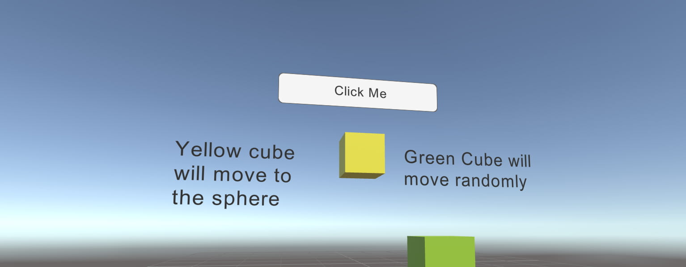
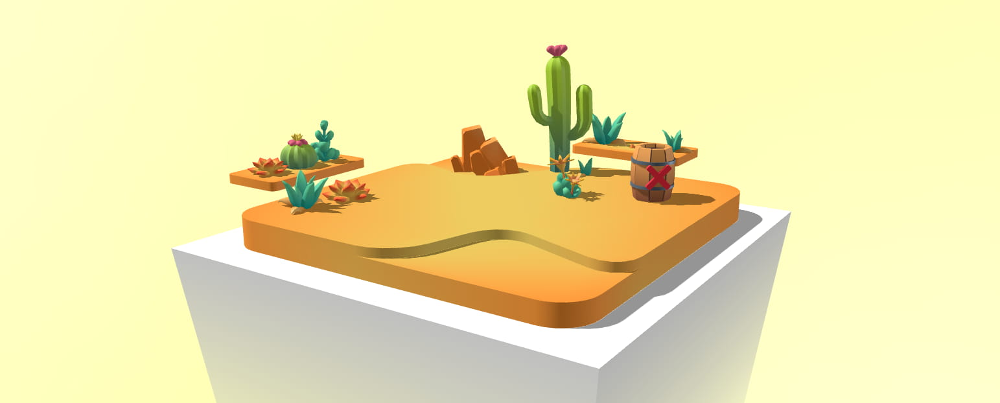
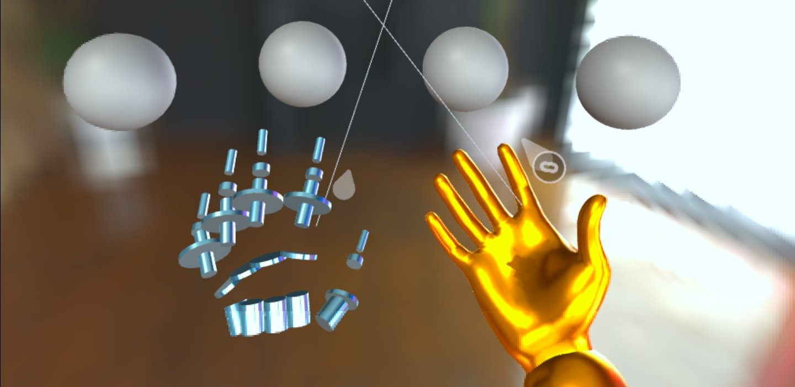
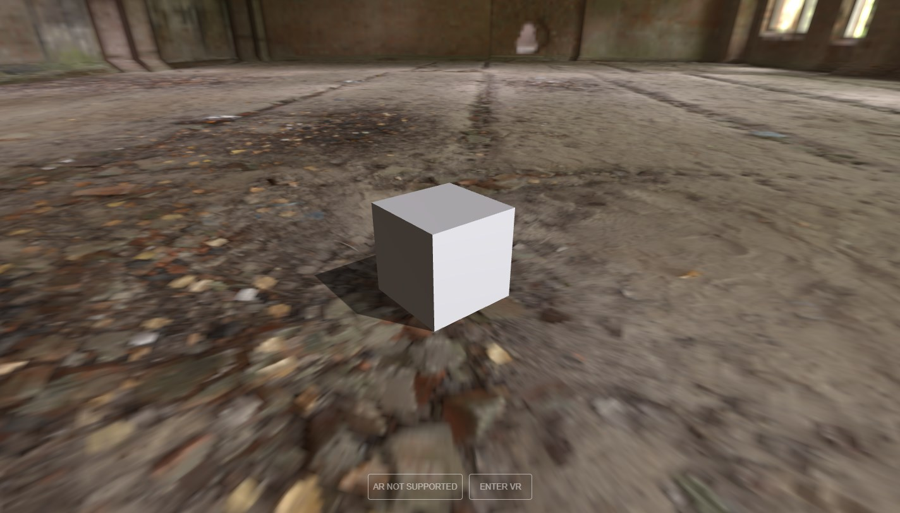
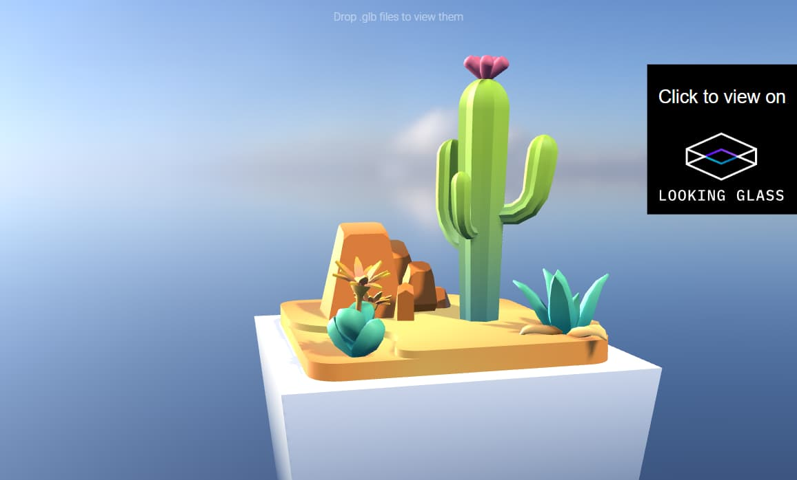
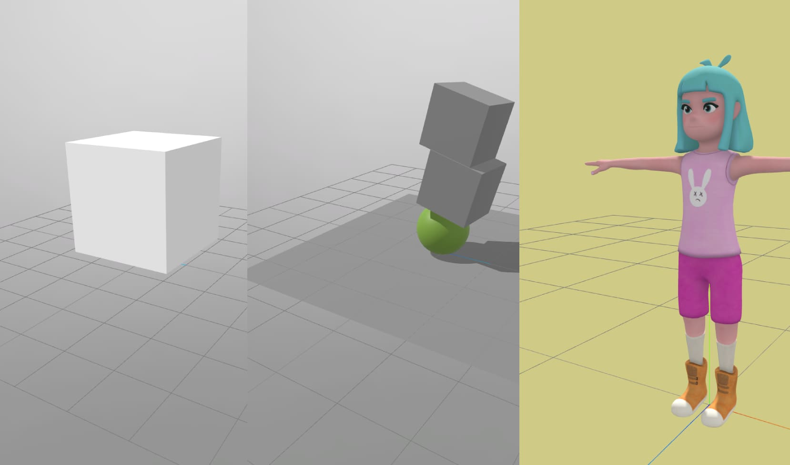
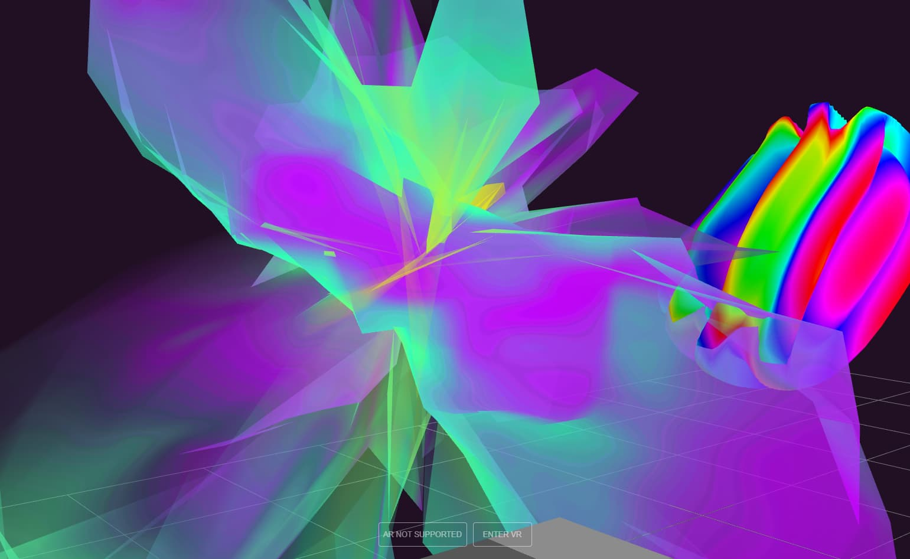
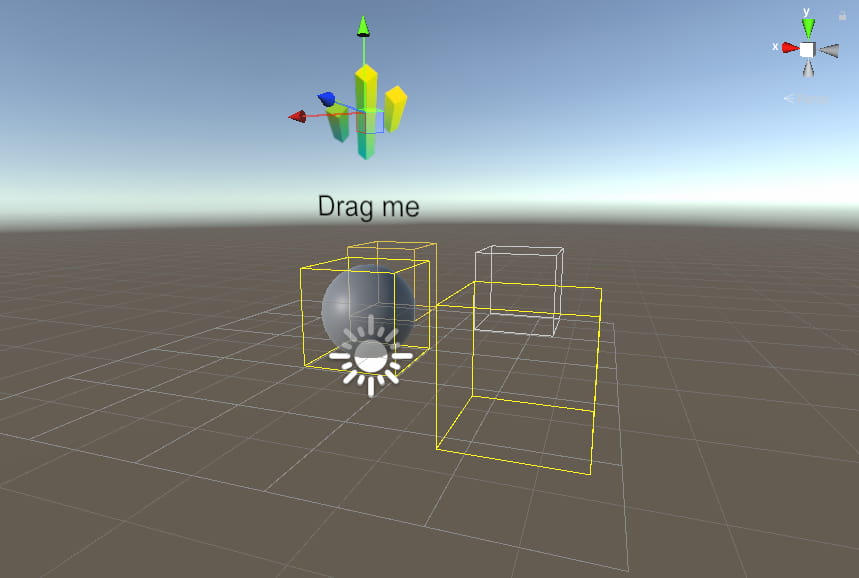

# Samples

This is a list of all samples in this package. You can also find them in the Unity Package Manager window.

## Samples

| Sample | Description | Preview |
| --- | --- | --- |
| [Animated Properties](https://engine.needle.tools/samples/animated-properties) | Powerful animation capabilities. Animate material values, scripts, objects. | 
| [Canvas UI](https://engine.needle.tools/samples/ui-button) | Create 3D UIs with Canvas | 
| [Collaborative Sandbox](https://engine.needle.tools/samples/sandbox) | Networking, WebXR, Drag & Duplicate | 
| [Custom Hands](https://engine.needle.tools/samples/custom-hands/) | Custom hand models in WebXR | 
| [Deferred Textures](https://engine.needle.tools/samples/progressive-textures) | Faster load times, smaller payloads | 
| [Device Sensors](https://engine.needle.tools/samples/device-sensors/) | Orientation Sensor Access | 
| [Ground Projection](https://engine.needle.tools/samples/groundprojection) | Floor projection from environment maps | 
| [HTML AR Overlay](https://engine.needle.tools/samples/ar-overlay/) | Custom DOM Overlays in AR | 
| [HTML Custom Layout](https://engine.needle.tools/samples/html-custom-layout) | Custom DOM Layout | 
| HTML Custom XR Buttons |  | 
| [iframe Content](https://engine.needle.tools/samples/iframe-content/?url=https://www.youtube.com/embed/puWNRrG4MCg) | Displaying external web pages in 3D | 
| [Integrating p5.js](https://engine.needle.tools/samples/p5js) | Dynamic Textures | 
| [Looking Glass](https://engine.needle.tools/samples/looking-glass/) | 3D Holographic Display - look.glass | 
| [Multi Scenes (dynamic loading)](https://engine.needle.tools/samples/dynamically-load-scenes) | Lazy load and switch scenes | 
| [Particles](https://engine.needle.tools/samples/particles/) | Particle Systems and Trails | 
| [Physics & Animation](https://engine.needle.tools/samples/physics-animation/) | Physical objects interacting with animated objects | 
| [Physics Basic](https://engine.needle.tools/samples/basic-physics) | Simple physics scene with objects changing colors on collision | 
| [Physics Playground](https://engine.needle.tools/samples/physics-cannon/) | Rigidbodies, Colliders, Triggers | 
| [Portal Rendering](https://engine.needle.tools/samples/stencil-portals) | Using stencil buffers | 
| [Product Scrollytelling](https://engine.needle.tools/samples/scrollytelling/) | Lnyx R1 scrolling website | 
| [Screensharing](https://engine.needle.tools/samples/screensharing) | WebRTC and Streaming | 
| [Shaders](https://engine.needle.tools/samples/custom-shaders) | Exporting Unity Shaders to the web | 
| [Spatial Triggers](https://engine.needle.tools/samples/spatial-triggers/) | Reactive Zones and Events | 
| [Third-Person Controller](https://engine.needle.tools/samples/character-controller) | Characters, Animations and Controls | 
| Fonts |  | 
| Joints |  | 
| Misc Scripting |  | 
| Object Visibility |  | 
| Particles Burst on click |  | 
| Shader Test |  | 
| Video Player |  | 

