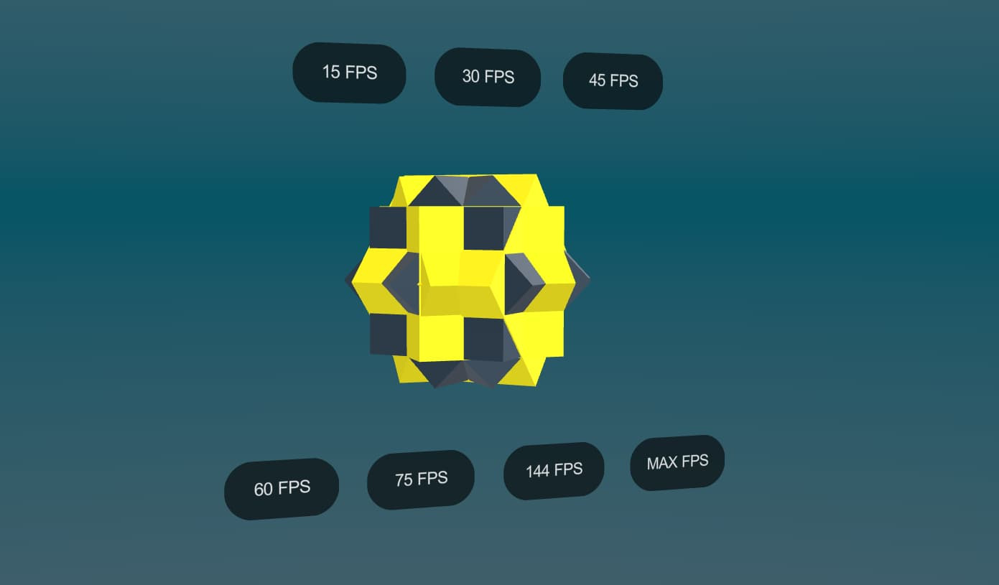

# Samples

This is a list of all samples in this package. You can also find them in the Unity Package Manager window.

## Samples

| Sample | Description | Preview | 
| --- | --- | --- |
| [See through](https://see-through-walls-zubcksz28jgxs.needle.run/) | This sample uses the Seethrough component to automatically fade out objects between the camera and a target object.  <kbd>Interaction</kbd> <kbd>Rendering</kbd>| 
| [Bike Scrollytelling - Responsive 3D](https://scrollytelling-bike-z23hmxb2gnu5a.needle.run/) | Use Needle Engine Timeline, ScrollFollow, ViewBox and FocusRect components to create a dynamic and responsive scrollytelling experience.  <kbd>Animation</kbd> <kbd>Interaction</kbd> <kbd>HTML</kbd> <kbd>Responsive</kbd>| 
| [Scrollytelling and Cursor Interaction](https://scrollytelling-2-z23hmxby7c6x.needle.run/) | No-code example for how to use the window scroll and cursor to control physics, lights and timeline animation  <kbd>Rendering</kbd> <kbd>Animation</kbd> <kbd>Physics</kbd> <kbd>Interaction</kbd> <kbd>HTML</kbd>| 
| [Droplistener](https://droplistener-zubcksz1veaoo.needle.run/) | Drop a 3D asset on the page to render. With networking functionality the DropListener is able to fetch and load dropped assets as well.  <kbd>Interaction</kbd> <kbd>Networking</kbd> <kbd>Dynamic Content</kbd>| 
| [Splines Scroll Example](https://splines-scroll-zubcksz2rarmn.needle.run/) | Using Splines and Scroll Animation  <kbd>Animation</kbd> <kbd>Interaction</kbd> <kbd>Responsive</kbd>| 
| [Face Filter](https://engine.needle.tools/samples-uploads/facefilter/) | Create your own unique face filters with blendshapes, animations and particles. Record videos for your social media or share the link with friends and family  <kbd>Rendering</kbd> <kbd>Interaction</kbd> <kbd>Games</kbd>| 
| [Look At Cursor Interactive 3D Header](https://look-at-cursor-zubckszo5bwc.needle.run/) | Create a unique and interactive website header. Make a character look at your mouse cursor.  <kbd>Interaction</kbd> <kbd>HTML</kbd> <kbd>Frontend</kbd> <kbd>Physics</kbd> <kbd>Animation</kbd> <kbd>Games</kbd>| 
| [Characters (Everywhere Actions)](https://usdz-characters-zubckssncjg.needle.run/) | Character controller that works in iOS AR too  <kbd>iOS AR</kbd> <kbd>XR</kbd> <kbd>Interaction</kbd> <kbd>USDZ</kbd> <kbd>Everywhere Actions</kbd>| 
| [Configurator](https://configurator-zubcksdobfe.needle.run/) | Changing objects and materials via script.  <kbd>Interaction</kbd> <kbd>Scripting</kbd> <kbd>XR</kbd> <kbd>Networking</kbd>| 
| [Device Sensors](https://engine.needle.tools/samples-uploads/device-sensors/) | Orientation Sensor Access  <kbd>Scripting</kbd> <kbd>Interaction</kbd>| 
| [Hotspots](https://hotspots-zubckszghs1b.needle.run/) | Annotate 3D content  <kbd>Interaction</kbd> <kbd>Scripting</kbd> <kbd>XR</kbd>| 
| [Recorded Avatars](https://avatar-recording-zubcks1ha2hu.needle.run/) | Use your VR headset to record and animate your characters and avatars  <kbd>Animation</kbd> <kbd>Rendering</kbd>| 
| [Shooting Range](https://shootingrange-zubcks1sxocs.needle.run/) | Score the most points by hitting as many shots without missing!  <kbd>Games</kbd> <kbd>Interaction</kbd> <kbd>Scripting</kbd> <kbd>XR</kbd> <kbd>HTML</kbd>| 
| [Musical Instrument](https://musicalinstrument-zubcksz1usd7h.needle.run/) | Play audio and animation on click interactions  <kbd>iOS AR</kbd> <kbd>Audio</kbd> <kbd>XR</kbd> <kbd>Animation</kbd> <kbd>Everywhere Actions</kbd> <kbd>USDZ</kbd>| 
| [Image Tracking](https://image-tracking-zubckszr0qj2.needle.run/) | Placing content on physical image markers  <kbd>iOS AR</kbd> <kbd>XR</kbd> <kbd>Everywhere Actions</kbd> <kbd>USDZ</kbd>| 
| [External Content](https://engine.needle.tools/samples-uploads/dynamic-content) | Download textures & models from external sources  <kbd>Scripting</kbd> <kbd>Dynamic Content</kbd>| 
| [Bow & Arrow](https://engine.needle.tools/samples-uploads/bow-and-arrow/) | Minigame where you play as an archer  <kbd>Games</kbd> <kbd>XR</kbd>| 
| [Car Physics](https://car-physics-zubcksqzdwj.needle.run/) | Slalom minigame showcasing raycast vehicle physics  <kbd>Games</kbd> <kbd>Physics</kbd>| 
| [Collaborative Sandbox](https://collaborativesandbox-zubcks1qdkhy.needle.run/) | Networking, WebXR, Drag & Duplicate  <kbd>Networking</kbd> <kbd>XR</kbd> <kbd>Interaction</kbd>| 
| [Color Menu (Everywhere Actions)](https://usdz-color-menu-zubcksmqsjo.needle.run/) | Changing an object's material with a spatial menu  <kbd>iOS AR</kbd> <kbd>Interaction</kbd> <kbd>XR</kbd> <kbd>USDZ</kbd> <kbd>Everywhere Actions</kbd>| 
| [Deferred Textures](https://progressive-textures-zubcks2stjym.needle.run/) | Faster load times, smaller payloads  <kbd>Rendering</kbd> <kbd>Performance and Optimization</kbd>| 
| [Diamond Ring](https://jewelry-ring-zubckszopxdy.needle.run/) | High-quality jewelry rendering using shader pathtracing  <kbd>Rendering</kbd> <kbd>XR</kbd>| 
| [Gaussian Splatting](https://engine.needle.tools/samples-uploads/gaussian-splats) | Renderer and tooling for gaussian splatting, a novel way to render 3D content.  <kbd>Rendering</kbd> <kbd>Scripting</kbd>| 
| [Ground Projection](https://engine.needle.tools/samples-uploads/groundprojection) | Floor projection from environment maps  <kbd>Rendering</kbd>| 
| [Interactive Map](https://engine.needle.tools/samples-uploads/interactive-map) | Openstreetmap.org integration in 3D  <kbd>Scripting</kbd> <kbd>Frontend</kbd>| 
| [Level of Detail](https://engine.needle.tools/samples-uploads/lods/) | Increase and decrease quality based on camera distance. (LOD)  <kbd>Rendering</kbd>| 
| [Multiple Cameras](https://engine.needle.tools/samples-uploads/multiple-cameras) | Rendering multiple cameras to the screen  <kbd>Rendering</kbd> <kbd>Scripting</kbd>| 
| [Panorama Controls](https://engine.needle.tools/samples-uploads/panorama-controls) | Camera controls with gyroscope support  <kbd>Scripting</kbd> <kbd>Interaction</kbd> <kbd>XR</kbd>| 
| [Screensharing](https://screensharing-zubcks1qbdid.needle.run/) | WebRTC and Streaming  <kbd>Networking</kbd> <kbd>XR</kbd> <kbd>Video</kbd> <kbd>Interaction</kbd>| 
| [XR Mesh Detection](https://mesh-tracking-zubckszgqtfr.needle.run/) | Access and render room meshes on Quest 3  <kbd>XR</kbd> <kbd>Rendering</kbd>| 
| [Spatial Audio](https://spatial-audio-zubckswmztj.needle.run/) | Placing audio sources in 3D with spatial falloff  <kbd>Audio</kbd> <kbd>XR</kbd> <kbd>iOS AR</kbd> <kbd>Everywhere Actions</kbd> <kbd>USDZ</kbd>| 
| [Netlify](https://needle-engine-netlify-sample.netlify.app/) | Deploy projects made with Needle to Netlify  <kbd>Deployment</kbd>| 
| [NextJS](https://needle-engine-nextjs.vercel.app) | Integration with the NextJS framework.  <kbd>Frameworks</kbd> <kbd>Deployment</kbd> <kbd>Frontend</kbd>| 
| [Svelte integration](https://engine.needle.tools/samples-uploads/svelte-project-sample) | Integration with the Svelte web framework.  <kbd>UI</kbd> <kbd>Frameworks</kbd> <kbd>Frontend</kbd>| 
| [SvelteKit integration](https://needle-engine.github.io/sveltekit-sample/) | Integration with SvelteKit for dynamic or static pages  <kbd>UI</kbd> <kbd>Frameworks</kbd> <kbd>Frontend</kbd>| 
| [Vue.js Integration](https://engine.needle.tools/samples-uploads/vue-project-sample/) | Integration with the Vue.js web framework.  <kbd>UI</kbd> <kbd>Frameworks</kbd> <kbd>Frontend</kbd>| 
| [Configurator (Everywhere Actions)](https://usdz-product-zubcksm4nb6.needle.run/) | Configure your product in quicklook  <kbd>Rendering</kbd> <kbd>iOS AR</kbd> <kbd>Interaction</kbd> <kbd>USDZ</kbd> <kbd>Everywhere Actions</kbd>| 
| [Contact Shadows](https://engine.needle.tools/samples-uploads/contact-shadows) | Proximity based soft shadows for flat surfaces  <kbd>Rendering</kbd>| 
| [iframe Content](https://engine.needle.tools/samples-uploads/iframe-content/?url=https://www.youtube.com/embed/puWNRrG4MCg) | Displaying external web pages in 3D  <kbd>Rendering</kbd> <kbd>HTML</kbd>| 
| [MediaPipe Hands](https://engine.needle.tools/samples-uploads/mediapipe-hands/) | Control the scene with your hands  <kbd>XR</kbd> <kbd>Interaction</kbd>| 
| [Multiple lightmaps](https://engine.needle.tools/samples-uploads/multi-lightmaps/) | Easily bake multiple lightmaps for a scene and switch between different lightmaps at runtime.  <kbd>Rendering</kbd>| 
| [Particles](https://particles-zubcks1xe9hg.needle.run/) | Particle Systems and Trails  <kbd>Rendering</kbd>| 
| [Physics & Animation](https://engine.needle.tools/samples-uploads/physics-animation/) | Physical objects interacting with animated objects  <kbd>Animation</kbd> <kbd>Physics</kbd>| 
| [Physics Basic](https://engine.needle.tools/samples-uploads/basic-physics) | Simple physics scene with objects changing colors on collision  <kbd>Physics</kbd> <kbd>Interaction</kbd>| 
| [Physics Joints](https://engine.needle.tools/samples-uploads/joints/) | Connections between physical objects  <kbd>Physics</kbd>| 
| [Physics Playground](https://physics-playground-zubcksgtkqf.needle.run/) | Rigidbodies, Colliders, Triggers  <kbd>Physics</kbd> <kbd>Interaction</kbd>| 
| [Portal Rendering](https://engine.needle.tools/samples-uploads/stencil-portals) | Using stencil buffers  <kbd>Rendering</kbd>| 
| [Product Scrollytelling](https://scrollytelling-zubcks2kujpl.needle.run/) | Lynx R1 scrolling website  <kbd>Rendering</kbd> <kbd>Animation</kbd>| 
| [Reflection Probes](https://engine.needle.tools/samples-uploads/reflection-probes) | Set custom reflections per object  <kbd>Rendering</kbd>| 
| [Room Tracking & Passthrough](https://presence-platform-zubcks22eosc.needle.run/) | Physics, Passthrough, Walls and Furniture on Quest / Quest Pro  <kbd>XR</kbd> <kbd>Interaction</kbd> <kbd>Rendering</kbd>| 
| [Switchable Walls](https://engine.needle.tools/samples-uploads/switchable-walls/) | Plane Tracking, Passthrough, Spatial Understanding  <kbd>XR</kbd> <kbd>Rendering</kbd> <kbd>Interaction</kbd>| 
| [Third-Person Controller](https://engine.needle.tools/samples-uploads/character-controller) | Characters, Animations and Controls  <kbd>Animation</kbd> <kbd>Games</kbd> <kbd>Interaction</kbd>| 
| [Transmission](https://engine.needle.tools/samples-uploads/transmission/) | Glass vase refraction  <kbd>Rendering</kbd>| 
| [Voxel Editor](https://voxel-editor-zubcks2wodnr.needle.run/) | Very basic voxel editor made with Everywhere Actions  <kbd>Interaction</kbd> <kbd>iOS AR</kbd> <kbd>XR</kbd> <kbd>Everywhere Actions</kbd> <kbd>USDZ</kbd>| 
| [VRM Character](https://vrm-character-loading-zubcks1jt6hf.needle.run/) | Loading support for VRM files  <kbd>Dynamic Content</kbd> <kbd>Scripting</kbd>| 
| [Digital Landscape](https://digital-landscape-zubcksz1zn9ka.needle.run/) | Custom shader showcasing terrain visualization  <kbd>Rendering</kbd>| 
| [PostProcessing](https://engine.needle.tools/samples-uploads/postprocessing) | PostProcessing with DoF, Bloom, SSAO and more  <kbd>Rendering</kbd> <kbd>PostProcessing</kbd>| 
| [Sidescroller](https://engine.needle.tools/samples-uploads/sidescroller) | Sidescroller with desktop, touch and gamepad inputs, using sprites.  <kbd>Games</kbd> <kbd>Interaction</kbd> <kbd>Scripting</kbd>| 
| [Animated Materials](https://animatedmaterials-zubcks1a1tap.needle.run/) | Animate material values to create effects and transitions  <kbd>Animation</kbd> <kbd>Rendering</kbd>| 
| [Animated Properties](https://animatedproperties-zubcks1wsp0p.needle.run/) | Powerful animation capabilities. Animate material values, scripts, objects.  <kbd>Animation</kbd> <kbd>Rendering</kbd>| 
| [Animator (Everywhere Actions)](https://usdz-animator-zubcksql43a.needle.run/) | Humanoid character with switchable animations   <kbd>Animation</kbd> <kbd>iOS AR</kbd> <kbd>Everywhere Actions</kbd> <kbd>USDZ</kbd>| 
| [AnimatorController](https://animatorcontroller-zubckseqcin.needle.run/) | Simple animator controller to transition between two states and play a sound effect (no code)  <kbd>Animation</kbd>| 
| [AR Camera Background](https://engine.needle.tools/samples-uploads/ar-camera-background) | Modify the camera stream and use it for material effects.  <kbd>XR</kbd> <kbd>Rendering</kbd>| 
| [Body Tracking](https://engine.needle.tools/samples-uploads/body-tracking/) | Whole body tracking in XR  <kbd>XR</kbd> <kbd>Scripting</kbd>| 
| [Custom Hands](https://engine.needle.tools/samples-uploads/custom-hands/) | Custom hand models in WebXR  <kbd>XR</kbd> <kbd>Interaction</kbd>| 
| [Depth sensing](https://engine.needle.tools/samples-uploads/depth-sensing/) | Blend virtual objects with your real environment  <kbd>Rendering</kbd> <kbd>XR</kbd>| 
| [First Person Multiplayer](https://engine.needle.tools/samples-uploads/first-person-controller-multiplayer) | Character Controller with Touch Support and Multiplayer capability  <kbd>Games</kbd> <kbd>Networking</kbd> <kbd>Interaction</kbd> <kbd>Scripting</kbd>| 
| [First Person Singleplayer](https://engine.needle.tools/samples-uploads/first-person-controller-singleplayer/) | First Person Character Controller with Touch Support  <kbd>Games</kbd> <kbd>Interaction</kbd> <kbd>Scripting</kbd> <kbd>Physics</kbd>| 
| [Fonts and Text](https://engine.needle.tools/samples-uploads/fonts/) | Displaying text, rich text, font families  <kbd>UI</kbd>| 
| [Javascript Communication](https://engine.needle.tools/samples-uploads/javascript-communication) | Communication between Needle Engine and external javascript  <kbd>Scripting</kbd> <kbd>HTML</kbd> <kbd>Frameworks</kbd>| 
| [Jet Engine](https://jetengine-zubcksz23xxhr.needle.run/) | Showcase your product interactivly  <kbd>Animation</kbd> <kbd>Rendering</kbd> <kbd>USDZ</kbd> <kbd>Everywhere Actions</kbd> <kbd>iOS AR</kbd>| 
| [Line Drawing](https://linedrawing-zubcksz1uj4gf.needle.run/) | Collaborative drawing in 3D for sketches and scribbles  <kbd>Interaction</kbd> <kbd>Networking</kbd> <kbd>XR</kbd> <kbd>Rendering</kbd>| 
| [Material X](https://materialx-zubckswjke1.needle.run/) | MaterialX materials running in the browser with Needle Engine – industry-standard shaders at full fidelity.  <kbd>Rendering</kbd>| 
| [Multi Scene Example](https://multi-scenes-zubckszphbmb.needle.run/) | Load and switch scenes  <kbd>Performance and Optimization</kbd> <kbd>Dynamic Content</kbd>| 
| [Navmesh & pathfinding](https://engine.needle.tools/samples-uploads/navmesh/) | Generate navmesh and find a path between two points  <kbd>Scripting</kbd>| 
| [Networking Players](https://networking-players-zubcks1nyee.needle.run/) | Spawn and control networked players. Understand networking lifecycle for PlayerState.  <kbd>Networking</kbd> <kbd>Scripting</kbd>| 
| [Pen and Sword](https://engine.needle.tools/samples-uploads/mx-ink-pencil-and-sword) | Logitech MX Ink – XR Stylus for Meta Quest  <kbd>Interaction</kbd> <kbd>XR</kbd> <kbd>Rendering</kbd>| 
| [React Sample](https://needle-engine.github.io/react-sample/) | Integrate Needle Engine into a react component  <kbd>Frameworks</kbd> <kbd>HTML</kbd> <kbd>Frontend</kbd>| 
| [Realtime Clock](https://engine.needle.tools/samples-uploads//realtime-clock) | Code example  <kbd>Scripting</kbd>| 
| [Shaders](https://engine.needle.tools/samples-uploads/custom-shaders) | Exporting Unity Shaders to the web  <kbd>Rendering</kbd>| 
| [Snow Globe](https://snowglobe-zubckszvui3a.needle.run/) | Use Rigidbody and Collider components to make objects physical and collide with each other - without writing a single line of code.        <kbd>Physics</kbd> <kbd>iOS AR</kbd> <kbd>USDZ</kbd> <kbd>Everywhere Actions</kbd>| 
| [Summoning Animation](https://engine.needle.tools/samples-uploads/summoning-animation/) | Complex animation  <kbd>Rendering</kbd> <kbd>iOS AR</kbd> <kbd>XR</kbd> <kbd>USDZ</kbd> <kbd>Everywhere Actions</kbd>| 
| [Synchronized Animator](https://synced-animator-zubcksz1m7y0i.needle.run/) | Synchronize animator and animation state over network  <kbd>Networking</kbd> <kbd>Animation</kbd> <kbd>Scripting</kbd>| 
| [Texture Details](https://texture-details-zubcks29rlwv.needle.run/) | High-resolution textures and AR placement  <kbd>Rendering</kbd> <kbd>XR</kbd> <kbd>iOS AR</kbd> <kbd>Everywhere Actions</kbd> <kbd>USDZ</kbd>| 
| [Video Playback](https://video-playback-zubcksz234yi9.needle.run/) | Displaying videos, codecs, transparency  <kbd>Rendering</kbd> <kbd>Video</kbd> <kbd>Dynamic Content</kbd>| 
| [Visibility and State](https://engine.needle.tools/samples-uploads/object-visibility/) | Visibility, enabled/disabled, hierarchy  <kbd>Scripting</kbd> <kbd>Rendering</kbd>| 
| [Worldspace UI](https://engine.needle.tools/samples-uploads/worldspace-ui/) | Create 3D UIs with Canvas  <kbd>UI</kbd> <kbd>Animation</kbd>| 
| [Splines](https://splines-zubcks1p3ij0.needle.run/) | Paths made out of bezier curves  <kbd>Animation</kbd> <kbd>Scripting</kbd>| 
| [Movie Set](https://movieset-zubcksz1uleb3.needle.run/) | RenderTexture sample  <kbd>Rendering</kbd>| 
| [Framerates](https://engine.needle.tools/samples-uploads/framerate) | This sample shows how to modify the target framerate  <kbd>Performance and Optimization</kbd>| 
| [HTML AR Overlay](https://engine.needle.tools/samples-uploads/ar-overlay/) | Custom DOM Overlays in AR  <kbd>UI</kbd> <kbd>HTML</kbd> <kbd>Frontend</kbd>| 
| [HTML Custom Layout](https://engine.needle.tools/samples-uploads/html-custom-layout) | Custom DOM Layout  <kbd>UI</kbd> <kbd>HTML</kbd> <kbd>Frontend</kbd>| 
| [HTML Custom XR Buttons](https://engine.needle.tools/samples-uploads/html-custom-xr-buttons) | AR and VR buttons can be customized for your app.  <kbd>UI</kbd> <kbd>HTML</kbd> <kbd>Frontend</kbd>| 
| [Integrating p5.js](https://engine.needle.tools/samples-uploads/p5js) | Use p5.js to draw dynamic and interactive textures  <kbd>Interaction</kbd> <kbd>Rendering</kbd> <kbd>Frameworks</kbd> <kbd>Frontend</kbd>| 
| [Looking Glass](https://engine.needle.tools/samples-uploads/looking-glass/) | 3D Holographic Display  <kbd>Rendering</kbd> <kbd>Devices</kbd>| 
| [Particle Bursts](https://particle-burst-zubckszcfrke.needle.run/) | Emitting particles on interaction  <kbd>Rendering</kbd> <kbd>Scripting</kbd>| 
| [Particles On Collision](https://engine.needle.tools/samples-uploads/particles-on-collision/) | Particles Spawned on Collision with Slowmotion Effect and Physics Materials  <kbd>Interaction</kbd> <kbd>Scripting</kbd> <kbd>Physics</kbd>| 
| [Pencil Sword](https://engine.needle.tools/samples-uploads/pencil-sword/) | Combining pen data and 3D  <kbd>Interaction</kbd> <kbd>Scripting</kbd>| 
| [Product Flyover](https://engine.needle.tools/samples-uploads/product-flyover/) | Scroll through multiple product pages using a Timeline and Timeline Events  <kbd>Rendering</kbd> <kbd>Animation</kbd> <kbd>Dynamic Content</kbd> <kbd>Interaction</kbd>| 
| [Screenspace UI](https://engine.needle.tools/samples-uploads/screenspace-ui/) | Anchoring Canvas UI elements to the screen  <kbd>UI</kbd>| 
| [Shadow Catcher](https://shadowcatcher-zubcks1hvwok.needle.run/) | Render additive or masked transparent shadows, great for AR  <kbd>Rendering</kbd> <kbd>XR</kbd>| 
| [Spatial Triggers](https://engine.needle.tools/samples-uploads/spatial-triggers/) | Reactive Zones and Events  <kbd>Scripting</kbd> <kbd>Interaction</kbd>| 
| [Spritesheet Animation](https://engine.needle.tools/samples-uploads/spritesheet/) | Animate Sprites using AnimationClips  <kbd>Rendering</kbd> <kbd>Animation</kbd> <kbd>Games</kbd>| 
| [Deploy to FTP](https://engine.needle.tools/samples-uploads/deploy-to-ftp/) | Deploy projects made with Needle to an FTP Server  <kbd>Deployment</kbd>| 
| [Deploy to Github Pages](https://kipash.github.io/needle-sample-github-pages/) | Deploy projects made with Needle to GitHub Pages  <kbd>Deployment</kbd>| 
| [Deploy to Glitch](https://quark-knowledgeable-caravan.glitch.me/) | Deploy projects made with Needle to Glitch  <kbd>Deployment</kbd>| 
| [Deploy to Itch](https://itch.io/embed-upload/10256073?color=000000) | Deploy projects made with Needle to Itch.io  <kbd>Deployment</kbd>| 
| [Device Detection](https://device-detection-zubcksz2cygtl.needle.run/) | APIs for checking device, browser, and capabilities  <kbd>Scripting</kbd> <kbd>Devices</kbd>| 

